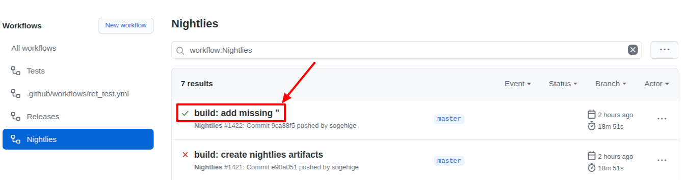

## Prerequisites

- **Browsers**: only latest Chrome/Chromium stable are supported
- **[Node.js](https://nodejs.org/en/)**: **18.x LTS** version
- **RAM**: Minimum 512MB, Recommended 1024MB
- **HDD**: Minimum 500MB
- Twitch bot account

!> You need **separate** account for your bot, bot **won't** work on your
   broadcaster account

## Docker

### Docker prerequisites

- **Docker**, Any of the [supported repositories](http://sogebot.github.io/sogeBot/#/configuration/database)

### Docker installation

!> If you want to use **SQLite**, be sure to use `./shared/sogebot.db` path to
   your db file, so you have an access outside of docker.

!> Note that **localhost** is accessing docker localhost. You need to use full
   IP address for your database connections.

1. Download `Docker Compose` files
    - From GIT: `git clone git@github.com:sogebot/sogeBot-docker.git`
    - Without GIT as [ZIP](https://github.com/sogehige/sogeBot-docker/archive/master.zip)
2. Configure properly .env file in `root` directory
    - You can find examples at [our GitHub repository](https://github.com/sogebot/sogeBot/tree/master/src/data)
3. Download bot images with `docker compose`
    - Release version: `docker-compose pull`
    - Nightly version: `docker-compose -f docker-compose-nightly.yml pull`
4. Startup your bot (add -d if you want to detach process)
    - Release version: `docker-compose up`
    - Nightly version: `docker-compose -f docker-compose-nightly.yml up`

### Upgrade bot from Docker

1. Stop your docker container
2. Run steps 3. and 4. from Installation

## From ZIP

### Stable

- Download latest release from
  [GitHub sogeBot release page](https://github.com/sogebot/sogeBot/releases)
- Continue at [ZIP Installation](#zip-installation)

### Nightlies

- Download desired nightly version from [GitHub sogeBot nightlies page](https://github.com/sogebot/sogeBot/actions?query=workflow%3ANightlies)
- Select run, you want to use (newest first)

- Scroll down and download nightly artifact

- Continue at [ZIP Installation](#zip-installation)

### ZIP Installation

- Download your stable release or nightly (see above)
- Set your [database environment](configuration/database)
- Add bot as channel editor
  in [Permissions settings](http://twitch.tv/dashboard/permissions) on Twitch
- be sure that you have latest npm installed

    `npm install --location=global npm@latest`

- before starting a bot, you need to install npm dependencies

    `npm install`

- start bot

    `npm start`

- To access webpanel, go to `http://localhost:<port>` where port is configured
  as PORT env variable, e.g. `PORT=20001 npm start`

### Upgrade bot from ZIP

1. Backup your `.env` and, if using sqlite3, `sogebot.db` file
2. Remove your sogeBot directory
3. Go through Installation steps
4. Before `npm start` recopy your backup back to bot folder

## From GIT

### Build prerequisites

- **Bash**, **Make**, **Git**

### GIT Installation

- Download [latest master zip](https://github.com/sogebot/sogeBot/archive/master.zip)
  or clone repository `git clone https://github.com/sogebot/sogeBot.git`
- Set your [database environment](configuration/database)
- Add bot as channel editor
  in [Permissions settings](http://twitch.tv/dashboard/permissions) on Twitch
- be sure that you have latest npm installed

    `npm install --location=global npm@latest`

- before starting a bot, you need to build a bot

    `make`

- start bot

    `npm start`

- To access webpanel, go to `http://localhost:<port>` where PORT is environment
  variable with default value `20000`

### Upgrade bot from GIT

1. Backup your database
2. Update bot with `git pull -r origin master`
3. Run `npm install --location=global npm`
4. Run `make`
5. Start bot `npm start`
